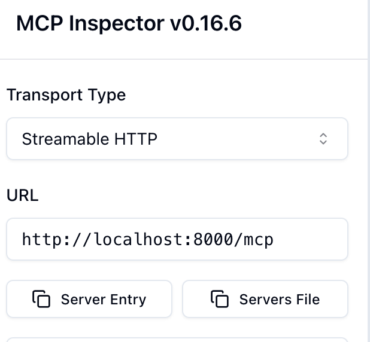

# The Manipulator of Core Power

We're going to include some tooling! And the easiest and best way to do that in the world of Bedrock is to use an MCP. Some say that stands for Model Contex Protocol, but we all know it's actually the Manipulator of Core Power. We'll use MCP for now as that's easier to say.

MCPs can serve different uses and in our case what we want to do is create an MCP that will enhance the world. We can do this in many ways, but we'll stick with an easy one. We're going to have our MCP decide what waits for us at our chosen destination.

If you have another idea to enhance your world, you can of course build that instead!

But let's continue with building our MCP. We'll go very basic as this isn't a workshop for creating MCPs. And in fact, AgentCore works a bit different in that regard anyway.

First, in step 1 you noticed we needed to install the mcp pip library. If you haven't done so yet, now is a good time `pip install mcp`. Or you can set it up with uv like we did for the agents.

Now, let's create an mcp directory and an appropriately named subdirectory `mkdir -p mcp/path_manipulator`.

In the path_manipulator directory we will then create the following `path_manipulator.py` file:

```python
import random

from mcp.server.fastmcp import FastMCP
from starlette.responses import JSONResponse

mcp = FastMCP(host="0.0.0.0", stateless_http=True)

@mcp.tool()
def decide_path() -> str:
    """Decide what the player finds in the path"""
    options = ["nothing", "a treasure chest", "demonic entities"]
    return random.choice(options)


if __name__ == "__main__":
    mcp.run(transport="streamable-http")

```

We can now try running this MCP by just running it:

```bash
python path_manipulator.py
```

This will start the MCP server for us to test. Which we'll do using the mcp-inspector tool. This is a Node package that you can install and run by running

```bash
npx @modelcontextprotocol/inspector
```

Once started, it will open a browser window. There you can select Streamable HTTP and set the URL to `http://localhost:8080/mcp`.



On the right hand side you can then select Tools. You click on List Tools, then our decide_path tool, and then you can run it to see your random result.

Great! It's working. You can ask agentcore for another reward if you like.

**Oh no! The demonic entities have trapped you in a dead end!**

Unfortunately this doesn't get it into AgentCore in the way we want. Yes, I made you do this work for nothing! (That's why you should read the whole file before you start).

That said, you can run the MCP as an agent if you wish, which is a good way for hosting an MCP (and the reason I made you do this)

```bash
agentcore configure -e path_manipulator.py --protocol MCP
```

Just approve the defaults again, with it creating the IAM roles etc for you.

```bash
agentcore launch
```

> Note: I've had it happen that the launch failed due to permission issues, but if you just run the command again after a minute it succeeds. :shrug:

And then you can use it.

## AgentCore Gateways

Now, let's switch to how AgentCore lets you run custom code, accessible through what they call gateways. There are several ways, but of course AWS defaults to our old favourite Lambda. First however, we need to create a gateway:

```bash
agentcore create_mcp_gateway --region ap-southeast-2 --name PathManipulator
```

When you do this, you will automatically get things like Cognito set up. Obviously you can configure this or any other OAuth server to use, but for ease of use we'll go with the automatically created option.

> Important! Keep the output of the command. You'll need it later.

Now, we'll use the same code as before, but deploy it as a Lambda function. Because SAM is still the easiest way to deploy a Lambda, that's what we'll use here.

```yaml
AWSTemplateFormatVersion: '2010-09-09'
Transform: AWS::Serverless-2016-10-31
Description: SAM template for path manipulator Lambda function

Globals:
  Function:
    Timeout: 30
    MemorySize: 256
    Runtime: python3.13

Resources:
  PathManipulatorFunction:
    Type: AWS::Serverless::Function
    Properties:
      FunctionName: path-manipulator
      Description: MCP path manipulator function that decides what player finds
      InlineCode: |
        import random
        import json

        def lambda_handler(event, context):
            """Lambda handler for path manipulator"""
            # Extract the action from the event
            action = event.get('action', 'decide_path')

            if action == 'decide_path':
                return decide_path_response()
            else:
                return {
                    'statusCode': 400,
                    'body': json.dumps({'error': 'Unknown action'})
                }

        def decide_path_response():
            """Decide what the player finds in the path"""
            options = ["nothing", "a treasure chest", "demonic entities"]
            result = random.choice(options)

            return {
                'statusCode': 200,
                'headers': {
                    'Content-Type': 'application/json'
                },
                'body': json.dumps({
                    'result': result,
                    'message': f'The player finds: {result}'
                })
            }
      Handler: index.lambda_handler
      Environment:
        Variables:
          ENVIRONMENT: production

Outputs:
  PathManipulatorFunctionArn:
    Description: ARN of the path manipulator Lambda function
    Value: !GetAtt PathManipulatorFunction.Arn
```

After deploying this we'll have the arn of our Lambda function, which we can add as a target to our gateway.

